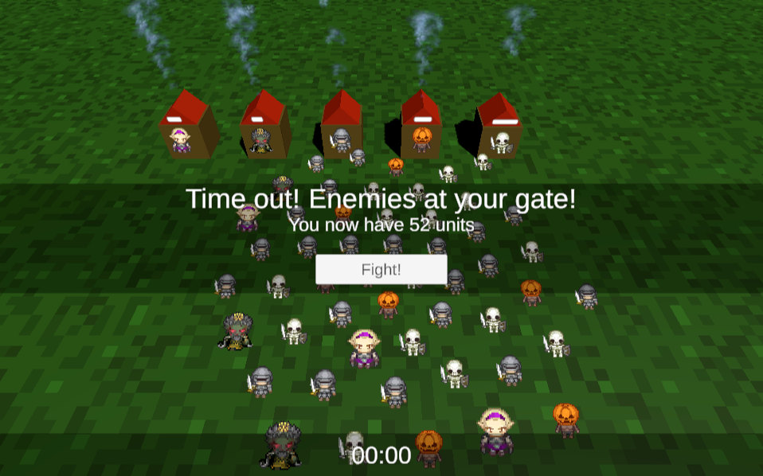
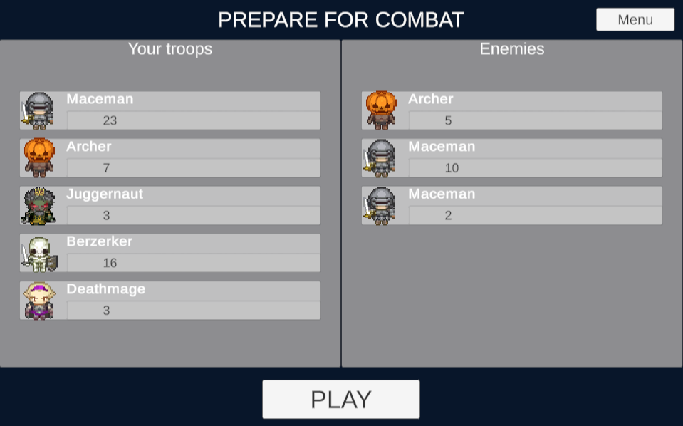
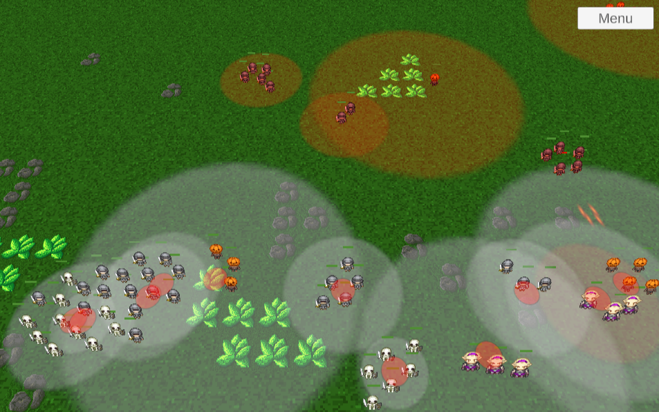

# global-fakejam-2020

This game was developed for the Global Gamejam 2020 but just one week later, because some members of the team could not join that weekend.

Developed in Unity2019.3.0f6.

# Game

Strategy game where you produce units and combat with them, organised in squads!
The game is split in two phases:
 - Unit production
 - Combat

## Unit Production

Tap on a building to start the production of a unit. You will want to amass the highest amount, so don't stop tapping!

## Combat

There are 5 differeent types of Unit in the game. Different units have different health, attack range, attack speed, damage, and even attack patterns. Explore and learn how to use them best!

**Berzerker Skeleton:**
Moves fast. Attacks fast. Dies fast. Everything fast. Gangs up on a single opponent, and tears them to shreds.

**Maceman Soldier:**
A well rounded troop. Decent health and damage. Cleaves through 3 enemies with a single blow!

**Pumpkin Archer:**
High damage, but long reload. Keep them protected from skeletons!

**Juggernaut Lich:**
Lots of HP, with a slow AOE Attack. Anything caught in the blast zone will suffer.

**Deathmage Elf:**
Glass cannon. Low, health, but has extremely high damage, single shot attack, that can kill a juggernaut in one hit!

## Progression

You will take your surviving units with you to the next levels, where you can build more armies and fight more challenging battles.

You can also Generate a Random Battle from the Main Menu.

## Controls

Use your mouse for performing all actions in game.

You control squads with Orange Banner Flags. The Enemy controls squads with Purple flags.

To move your units on the battlefield, **Click on a squad's Banner Flag**, and then click on a map location. Squad members will do their best to reach that location.

**Click and Drag** anywhere on the screen to move the Camera.

Press **Escape** (or cancel button) to access the in game menu.

# Team
 - Giancarlo Dessena ([PixelBumper](https://github.com/PixelBumper))
 - Andy Michael ([GustoGaiden](https://github.com/GustoGaiden))
 - Sergio R. Lumley ([lumley](https://github.com/lumley/))
